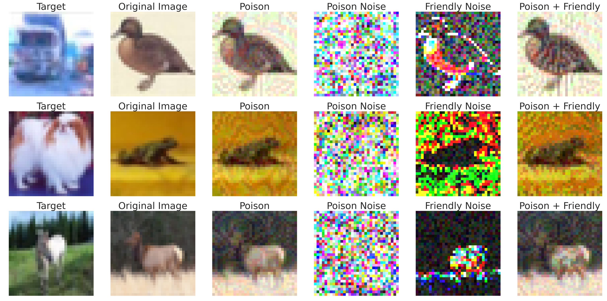

# Friendly Noise against Adversarial Noise: A Powerful Defense against Data Poisoning Attacks (NeurIPS 2022)



Official code repository for [Friendly Noise against Adversarial Noise: A Powerful Defense against Data Poisoning Attacks](https://arxiv.org/abs/2208.10224).

Authors: Tian Yu Liu, Yang Yu, and Baharan Mirzasoleiman

### Dataset preparation
For preparation of poisoned datasets, please follow: https://github.com/YuYang0901/EPIC

### Example Usage
For training with friendly noise and bernoulli noise.
```
python main.py --noise_type friendly bernoulli --friendly_begin_epoch 5 --poisons_path $POISON_DATASET --out result 
```

### Acknowledgements
- https://github.com/JonasGeiping/poisoning-gradient-matching
- https://github.com/aks2203/poisoning-benchmark
